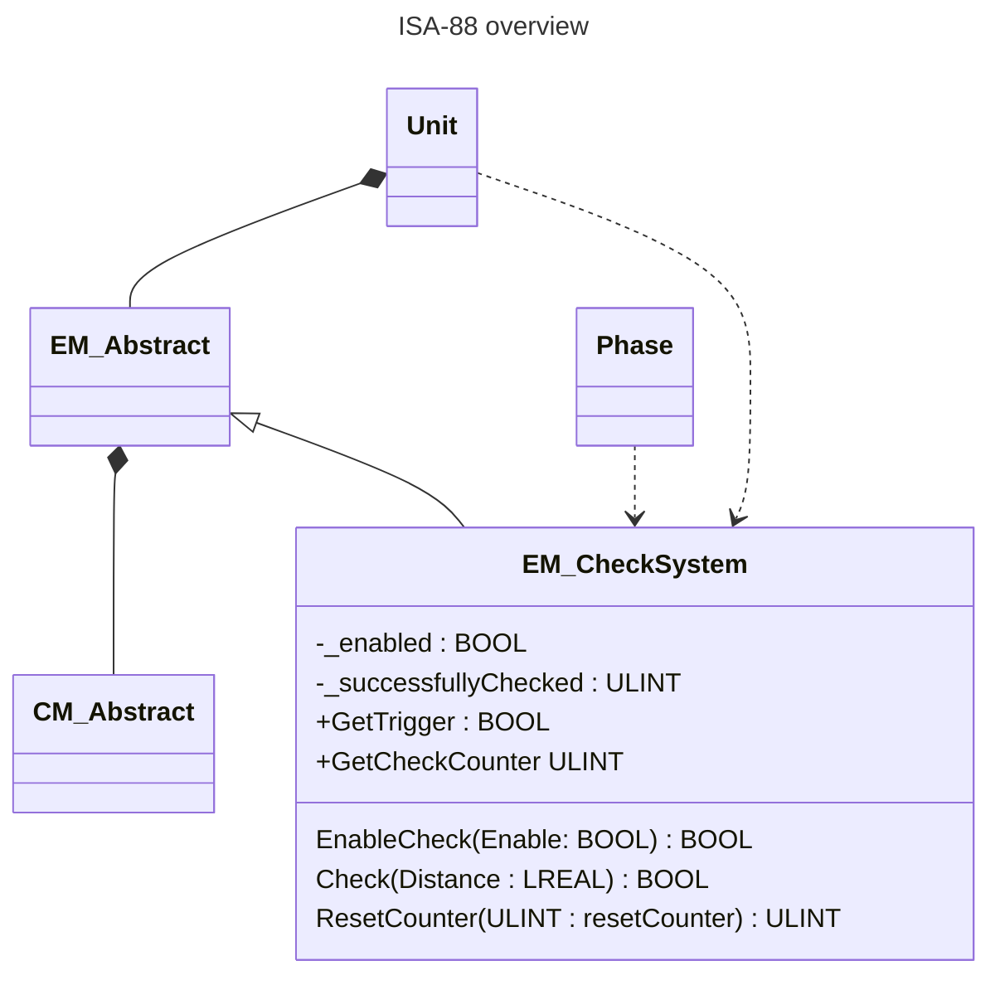

<h1 align="left">
  <br>
  
  <br> Advanced Automation Lab 02
  <br>
</h1>

Author: [Cédric Lenoir](mailto:cedric.lenoir@hevs.ch)

# Lab Objective 02, Equipment Module
Process a complete piece of equipment.
- The equipment must perform a simple control task.
- The equipment must be configurable using the Pack-Tag.
- The equipment must include one or more alarms and one or more warnings.
- The equipment must be controllable by one or more methods, which, in the context of ISA-88, means that:
- The equipment could be controllable via a manual or automatic phase.
  
## ISA 88 context



:bulb: In this case, we use the **Dependency**, *the arrow with dashed line*. It indicates that the Phase use a method of the Equipment module.

This means that EM_CheckSystem methods can be used internally by the unit (e.g., the programmable logic controller) or from an external call originating from a higher-level control system such as a SCADA system. The SCADA command can be sent automatically by a computer or by a human operator.

:bulb: Equipment providing these services can then, depending on the needs:
- Be operated manually via a user interface.
- Be operated automatically via a sequence internal to the unit.
- Be operated automatically via a procedure through a phase.

---

## Base for the work

Use the program ``..\aaut_lab_02_2026\plc\AAut-lab-02_2026_V_3_6`` for the PLC.
Use the node ``..\aaut_lab_02_2026\NodeRED\flow.json`` as test UI.

---

:warning: For tests, explain how you do the tests, for example by adding auxiliary variables.

---

## Part one / 1, of the lab.
1.  Build a EM_CheckSystem on the model of EM_Example, see PLC Code.
2.  EM_CheckSystem overrides three methods of EM_Abstract.
    1.  Resetting
    2.  Stopping
    3.  Execute
3.  Resetting call a method ``EnableCheck(Enable: BOOL)`` with ``Enable := TRUE``.
    1.  The method set ``_enabled`` to Enable.
    2.  The method returns ``_enabled``,   
    3.  ``Resetting_SC`` is the result of the method.
4.  Stopping call a method ``EnableCheck(Enable: BOOL)`` with ``Enable := FALSE``.
    1.  The method set ``_enabled`` to Enable.
    2.  The method returns ``_enabled``,   
    3.  ``Stopping_SC`` is the inverse of the method, that is, ``NOT _enabled`` .
5. Use and test ``EM_CheckSystem`` with the instance name ``emCheckSystem`` in the program ``PRG_Unit-``

**Check and test your code**.

---

## Part two / 2 of the lab.
The robot, see ``EM_Robot`` in the program, has a get property ``GetTrigger``  this property is ``TRUE`` only when the robot is on target in automatic mode. ``(eMoveToTarget = E_MoveToTarget.eIsOnTarget)``.

See in program: ``HEVS_Tools/PRG_PackUpdate``
- ``PackTag.Status.Parameter_Lreal[8].ID := 1008;``
- ``PackTagStatus.Parameter_Lreal[9].ID := 1009;``

1.  Build in EM_CheckSystem a method ``Check(Distance : LREAL)`` this method use the sensor distance of ``GVL_Abox.uaAboxInterface.uaO300_DL_Optic.Value`` and the signal ``GetTrigger`` to count the number of time the function returns a value ``TRUE``. :bulb: Select a custom distance between 100 and 200.
2.  You should use the trigger on ``emRobot.GetTrigger`` in the program ``PRG_Unit`` to call the method ``emCheck.Check(Distance : LREAL)``.
3.  You have the right to write a quick and dirty code to use the distance of ``uaO300_DL_Optic``.


**Check and test your code**.

---

## Part three / 3 of the lab.

1.  In ``PRG_Unit``, add a **warning** for both **resetting** and **stopping** if the transition state have a duration of more than 5 seconds.
2.  Use the values of ``PRG_PackUpdate`` to configure the motion of the robot in Execute, **note these values for the tests**, and **suspend** the system with an **alarm** if ``EM_CheckSystem`` does not detect the robot when moving in the front of sensor **DM_O300_DL_optical**.

**Check and test your code**.

---

## Part four / 4 of the lab.
1.  Add a get property ``GetCheckCounter`` on EM_CheckSystem to return the value ``_successfullyChecked`` to the status ID 1010 in ``HEVS_Tools/PRG_PackUpdate``. Convert the value to LREAL if needed.
2.  Add a method ``ResetCounter(ULINT : resetCounter)`` to reset the value _successfullyChecked to 0. Use command ID 2010 of ``HEVS_Tools/PRG_PackUpdate`` to test your method. The method returns the value of ``_successfullyChecked``. Add and convert the Command.Parameter_Lreal[10] as input of the method to test it. 


**Check and test your code**.

---

## Annex alarms and warnings.

**Instance of alarms and warning**
```iecst
   fbSetAlarm_0     : FB_HEVS_SetAlarm(diAlarmId := 11);
   fbSetWarning_0   : FB_HEVS_SetWarning(diWarningId := 21);
```


---
**Call to alarms and warnings**
:bulb: you can have a look in the program: ``HEVS_Tools/PRG_TestAlarms`` for alarms and test effect with the UI from Node-RED.

```iecst
fbSetAlarm_0(// Bit activation of Alarm and Ack
             xSetAlarm := PackTag.hevsPackAlarm_UI.uiSetAlarm_0,
             xAckAlarmTrig := PackTag.hevsPackAlarm_UI.uiAckAlarm_0 OR FC_HEVS_GetAckAlarmById(fbSetAlarm_0.GetUniqueId),
             // Alarm Parameters
             Value := 35,
             Message := 'Abort 4, E-Stop',
             Category := E_EventCategory.Abort,
             // Reference to plc time from PackTag
             plcDateTimePack := PackTag.Admin.PLCDateTime,
             // Link to PackTag Admin
             stAdminAlarm := PackTag.Admin.Alarm,
             stAdminAlarmHistory := PackTag.Admin.AlarmHistory);


fbSetWarning_0(xSetWarning := PackTag.hevsPackAlarm_UI.uiSetWarning_0,
               xAckWarningTrig := PackTag.hevsPackAlarm_UI.uiAckWarning_0 OR FC_HEVS_GetAckWarningById(fbSetWarning_0.GetUniqueId),
              // Warning Parameters
              Value := 31,
              Message := 'Warning 0, Door Open',
              Category := E_EventCategory.Warning,
              // Reference to plc time from PackTag
              plcDateTimePack := PackTag.Admin.PLCDateTime,
              // Link to PackTag Admin
              stAdminWarning := PackTag.Admin.Warning);       
```

<!-- End of file -->