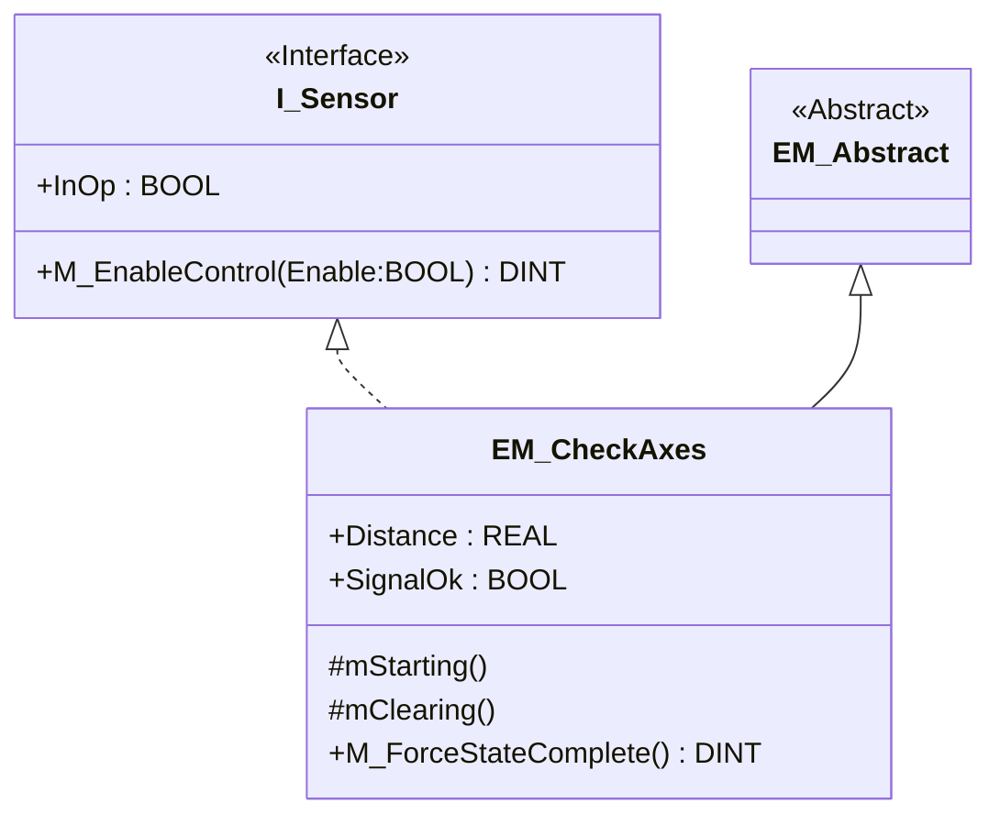

<h1 align="left">
  <br>
  
  <br> Advanced Automation Lab 02
  <br>
</h1>

Author: [Cédric Lenoir](mailto:cedric.lenoir@hevs.ch)


A remettre dans Autb docs

Les trois laboratoires se font selon le principe suivant.

OO in practice niveau Control Module
OO in practice niveau Equipement Module
OO in practice niveau Unit.

Dans le premier labo, nous abordons les principes OO pour le développement d'un Control Module
Dans le deuxième labo, nous abordons les principes OO pour le développement d'un Equipment Module.
Dans le troisième module, nous abordons l'angle machine avec la notion d'unités.

# Objectif Lab 02, Equipment module
Traiter un équipement complet.
- L'équipement doit exécuter une tâche de contrôle simple.
- L'équipement doit pouvoir être paramétré à l'aide du Pack-Tag.
- L'équipement doit comporter des alarmes ou des warning pour contrôler le système.
- L'équipement doit pouvoir être piloté par une ou plusieurs méthodes, ce qui dans le cadre de ISA-88, signifie que:
  - L'équipement doit pouvoir être piloté par une phase
  
<div style="text-align: center;">
  <figure>
    
    <figcaption>S88 relations</figcaption>
  </figure>
</div>

:bulb: Un équipement qui fournit ces services pourra ensuite selon les besoins:
- Etre piloté en mode manuel depuis une interface utilisateur.
- Etre piloté en mode automatique depuis une séquence interne à l'unité.
- Etre piloté en modue automatique depuis une procédure via une phase.

Digramme simplifié:
  EM Robot Pick part
  EM Control Check part 1
    Part 1 OK -> Increment part counter.
    Part 1 Not Ok -> Warning.
  EM Robot Place part
      
  Sequence EM robot.
  Méthodes
  1.  Control, *pick* Part in nest N° **Nx**.
  2.  Insert, *place" Part.
  3.  Eject part.
    Open Gripper (In Resetting)
    Move to starting (In Starting)  
    Move to Pick
    Close Gripper
    Move to Control
    Move to place
    Open Gripper.
    Move Up

  Sequence EM control
  1 Control, return TRUE or FALSE.

# Ce qu'il faut maitriser
  Ecrire une méthode pour un EM.
  Insérer alarmes et warning
  Compléter PackTag.

# Prérequis
- Module 01, 02, 03, 04, 05

# Base project
Basé sur projet AAut_Lab_03 a

## Keywords
Method, Interface, Property.

## Travail préparatoire
- Préparer le fichier Markdown avec header et diagramme Mermaid.
- La machine d'état du gripper doit être préparée à l'avance.
- Préparter une liste de test pour validation du travail.

### FS
On place les méthodes au niveau FS, on veut vérifier les méthodes au niveau OQ.
#### FS EM_Robot
- EM_robot take a part in nest N° *Nx* and move it in Control position
- EM_robot place part from Control Position to nest *Nx*.
- EM_Robot eject part.
- EM_Part controlled, every time a part is picked, a counter is incremented.

#### FS EM_Control
- A method return true or false depending of qualité of control.
- When part is good, number of good part is incremented
- When part is bad, number of bad parts is incremented.

**<span style="color: red;">Il est peut probable que vous réussissiez à termier ce TP si vous ne préparer pas le code du gripper à l'avance</span>**


## Ce que je veux faire.

# Première partie: un équipement

Je veux créer un équipement qui permet de détecter une position.
- Lors du **Starting**, on vérifie que la cible sur la caméra soit à une certaine distance de la cible sur la caméra.

**<span style="color: red;">Noter que cela concerne le mode automatique seulement car le starting est désactivé en mode manuel</span>**

- Par exemple: Lorsque la cible se trouve à 150 [mm] du capteur
  - Axe X : -135
  - Axe Y : 117
  - Axe Z : -105

### Ce que nous allons faire

<div align="center">



</div>

- Do not forget: **Methods and Properties should access only internal variable**, in `VAR..END_VAR`, it is a good practice to identify them with an underscore as prefix: `_Example`.
- **Warning** Si après TestDelay_ms on reste en Starting, on met un warning.
- InOp is Get only, it means device has been enabled with BOOL.
- SignalOk est l'inverse de qualitybit (Not .Q).
- On affiche la distance seulement si le quality bit est FALSE.
- ForceStateComplete permet de forcer le passage de SC en starting seulement.
- Methods implement a counter each time they are called.
- Device is enabled while Clearing. If not InOp, there is a warning.
- Distance is in millimeters.

#### Parameters
On utilisera **PRG_PackUpdate** pour mettre à jour les paramètresl
Voir répertoire **HEVS_Tools**.

Les paramètres sont:

```iecst
PackTag.Command.Parameter_Lreal[5].ID := 2005;
PackTag.Command.Parameter_Lreal[5].Name := 'Check Distance Axis X';
PackTag.Command.Parameter_Lreal[5].Unit := 'mm';

PackTag.Command.Parameter_Lreal[6].ID := 2006;
PackTag.Command.Parameter_Lreal[6].Name := 'Check Distance Axis Y';
PackTag.Command.Parameter_Lreal[6].Unit := 'mm';

PackTag.Command.Parameter_Lreal[7].ID := 2007;
PackTag.Command.Parameter_Lreal[7].Name := 'Check Distance Axis Z';
PackTag.Command.Parameter_Lreal[7].Unit := 'mm';

PackTag.Command.Parameter_Lreal[8].ID := 2008;
PackTag.Command.Parameter_Lreal[8].Name := 'Check Distance Sensor';
PackTag.Command.Parameter_Lreal[8].Unit := 'mm';

PackTag.Command.Parameter_Lreal[9].ID := 2009;
PackTag.Command.Parameter_Lreal[9].Name := 'Delay For Starting';
PackTag.Command.Parameter_Lreal[9].Unit := 'ms';
```

You can use these values directly in you code, as they are Global Variables.


```iecst
tonHevsStarting(IN := (actualState = E_PackState.eStarting),
                 PT := LREAL_TO_TIME(PackTag.Command.Parameter_Lreal[9].Value));
                 // Délai de 4 secondes après le début de l'état Starting

```

With UI you can then modify values with NodeRED, select the value then submit.

<div style="text-align: center;">
  <figure>
    
    <figcaption>Modify PackTag Command Parameters</figcaption>
  </figure>
</div>

> Précision de +- 1 mm

#### Access to sensor
- Values of the sensor are available in: GVL_ABox...ua**O300_DL_Optic**.
- You can use WORD_TO_REAL() for the signal conversion.

- You can check the values of the sensor on the **SIMATIC HMI**, tab **HW-IO**.

#### EM Id
Use 3 as Device Unique Id

```iecst
    emCheckAxes					: EM_CheckAxes(usiEmId := 3);
```

Do not forget to integrate your Equipment Module in the loop of **SC**.

```iecst
PLC_PACK_ABox.whatSC := emRobot.SC    AND
                        emExample.SC  AND
                        cmExample.SC  AND
                        emCheckAxes.SC;		
```

#### Axes position
You can use a Function Block.
This is not very clean, but as Axis references are global variables on this project, you could use them. For example for X Axis.

```iecst
// Header
mcReadActualPos_X   : MC_ReadActualPosition;    

// Body
mcReadActualPos_X(Axis := GVL_AxisDefines.X_Axis,
                  Enable := TRUE);
```

#### Warnings.
You could use this rule:

```iecst
(*
    Defines some alarms here
    Ideally, alarms should be EM Id, CM Id + Self alarm Id.
    For example EM Id = 1, CM Id = 2, Self alarm Id = 3 : Unique Id = 1002003
    Alarms on unit have EM Id = 0 and CM Id = 0.
    *)
fbSetWarningWaitClearing : FB_HEVS_SetWarning(diWarningId := 3000001);
```

An example of code
```iecst
tonHevsClearing(IN := (actualState = E_PackState.eClearing),
                        PT := T#4S);    // Délai de 4 secondes après le début de l'état clearing

fbSetWarningWaitClearing(xSetWarning :=tonHevsClearing.Q,
                         xAckWarningTrig := TRUE,
                         // Warning Parameters, value is optional
                         Value := 4,
                         Message := 'Check axis not clearing',
                         Category := E_EventCategory.Warning,
                         // Reference to plc time from PackTag
                         plcDateTimePack	:= PackTag.Admin.PLCDateTime,
                         // Link to PackTag Admin
                         stAdminWarning := PackTag.Admin.Warning); 

```


</div>

<div style="text-align: center;">
  <figure>
    
    <figcaption>Use helper to create FB, do not forget to select Structured Text</figcaption>
  </figure>
</div>

Do not forget monitoring for your properties

```iecst
{attribute 'monitoring':= 'call'}
```

<div style="text-align: center;">
  <figure>
    
    <figcaption>Copy / Paste Methods And Customize Them</figcaption>
  </figure>
</div>

<div style="text-align: center;">
  <figure>
    
    <figcaption>Add Methods And Properties To The Equipment</figcaption>
  </figure>
</div>


#### Si rien ne fonctionne...
Auriez-vous oublié d'appeler le Function Block parent ?

#### Configure the symbols

<div style="text-align: center;">
  <figure>
    
    <figcaption>Configure Symbols For Methods And Properties Of Your Equipment</figcaption>
  </figure>
</div>

# Deuxième partie

Si vous avez encore du temps, vous pouvez créer un Control Module à partir du FB du labo N° 1 puis l'intégrer dans l'Equipment module du robot.


# Annexe
Numéros d'état

```iecst
TYPE E_PackState :
(
    eUndefined := 0,
    eClearing := 1,
    eStopped := 2,
    eStarting := 3,
    eIdle := 4,
    eSuspended := 5,
    eExecute := 6,
    eStopping := 7,
    eAborting := 8,
    eAborted := 9,
    eHolding := 10,
    eHeld := 11,
    eUnholding := 12,
    eSuspending := 13,
    eUnsuspending := 14,
    eResetting := 15,
    eCompleting := 16,
    eCompleted := 17
) DINT;
END_TYPE
```